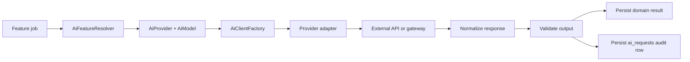

# AI Provider Abstraction Research

Research date: 2026-07-31

This document describes how this project should add AI API credentials and model usage without locking the codebase to one vendor. The goal is to support direct providers, marketplace routers, and self-hosted gateways from the dashboard while keeping email automation safe and testable.

## Recommendation

Build an application-owned AI provider abstraction first. Use an OpenAI-compatible chat-completions request shape as the baseline transport, then add provider adapters for features that are not portable.

This gives the dashboard one consistent way to store credentials and policies while still allowing these provider types:

- Direct OpenAI-compatible endpoints.
- OpenRouter, using `https://openrouter.ai/api/v1`.
- LiteLLM Proxy, using a user-owned base URL such as `https://ai.example.com`.
- OpenCode-compatible providers and OpenCode Zen-style gateways.
- Direct provider adapters later, for APIs that are worth first-class support.
- Prism PHP as an optional internal implementation detail later, not as the dashboard data model.

Do not design the database around one SDK's config format. Store durable provider/account/model policy in our own tables, then let adapters translate that into SDK or HTTP calls.

## Research Summary

OpenRouter exposes an OpenAI-compatible `/api/v1/chat/completions` endpoint and a `/api/v1/models` catalog endpoint. It can access many models behind one API key and supports model slugs such as `xiaomi/mimo-v2.5`. Their model catalog should be discovered dynamically because availability, price, and free-tier status change over time. Sources: [OpenRouter quickstart](https://openrouter.ai/docs/quickstart), [OpenRouter models API](https://openrouter.ai/docs/api/api-reference/models/get-models), [OpenRouter MiMo-V2.5 model page](https://openrouter.ai/xiaomi/mimo-v2.5).

LiteLLM Proxy is useful when the user already runs a central AI gateway. It presents an OpenAI-compatible API surface and handles cross-provider routing, retries, budgets, logging, and rate limits at the proxy layer. Source: [LiteLLM getting started](https://docs.litellm.ai/).

OpenCode V2 providers use provider/model catalogs with credentials supplied through `/connect`, environment variables, or provider settings. For custom OpenAI-compatible endpoints, OpenCode documents an `openai-compatible` provider package, explicit `baseURL`, and model capability metadata. This supports the same idea we need in Laravel: provider config, credentials, model IDs, capabilities, limits, headers, and body overlays should be separate concepts. Sources: [OpenCode V2 providers](https://opencode.ai/v2/docs/providers), [OpenCode V2 models](https://opencode.ai/v2/docs/models).

Google Gemini now documents OpenAI compatibility through an OpenAI-style base URL. This reinforces using OpenAI-compatible chat completions as the lowest common denominator, while keeping provider-specific fields behind adapters. Source: [Gemini OpenAI compatibility](https://ai.google.dev/gemini-api/docs/openai).

OpenAI and Anthropic expose richer native features, including tool use, structured outputs, streaming, and agent-oriented APIs. These should be modeled as capabilities rather than assumed for every provider. Sources: [OpenAI function calling and structured outputs](https://help.openai.com/en/articles/8555517-function-calling-in-the-openai-api), [Anthropic API overview](https://platform.claude.com/docs/en/api/overview).

Prism PHP is a Laravel/PHP-friendly option with providers for text, structured output, embeddings, images, streaming, and custom providers. It can be useful inside adapters, but the project should not rely on Prism config as the source of truth because this app needs encrypted dashboard-managed credentials, per-provider policies, audit logs, and approval workflows. Source: [Prism custom providers](https://prismphp.com/advanced/custom-providers/).

## Design Goals

- Store provider credentials in the admin dashboard.
- Encrypt all API keys and custom secret headers.
- Let users configure multiple providers and choose defaults per feature.
- Support OpenAI-compatible gateways with only `base_url`, `api_key`, `model`, and optional headers.
- Support model discovery where the provider exposes a catalog.
- Track cost, tokens, latency, status, and error categories per request.
- Keep AI calls queued and retryable.
- Keep destructive email actions behind explicit approval gates.
- Make providers replaceable in tests without network calls.

## Non-Goals

- Do not build a full autonomous agent runtime in the first AI provider phase.
- Do not allow AI to send, delete, archive, or label Gmail messages without an explicit app-owned policy and approval path.
- Do not assume every provider supports JSON schema, tools, streaming, images, or embeddings.
- Do not hardcode any model as free forever.
- Do not store prompts, email content, or provider responses in logs unless the feature explicitly requires it and the admin can see the retention policy.

## Provider Types

### OpenAI-Compatible

Use for OpenAI, OpenRouter, LiteLLM Proxy, Gemini compatibility endpoints, self-hosted gateways, and many third-party routers.

Required dashboard fields:

- Name.
- Provider type: `openai_compatible`.
- Base URL.
- API key.
- Default model.
- Is active.

Optional fields:

- Organization/project header.
- HTTP referer/title headers for OpenRouter attribution.
- Extra headers.
- Extra body defaults.
- Timeout.
- Retry count.
- Max input tokens.
- Max output tokens.
- Supports tools.
- Supports structured output.
- Supports streaming.
- Supports images.
- Supports embeddings.

### OpenRouter

OpenRouter can be treated as `openai_compatible` with convenience defaults:

- Base URL: `https://openrouter.ai/api/v1`.
- Model catalog endpoint: `GET /api/v1/models`.
- Optional headers: `HTTP-Referer`, `X-OpenRouter-Title`.

For MiMo-V2.5, use the catalog slug `xiaomi/mimo-v2.5` when available. The current OpenRouter model page presents it as a paid model, so the UI should show catalog-derived price/free information instead of static copy.

### LiteLLM Proxy

LiteLLM should be configured as a custom OpenAI-compatible gateway:

- Base URL: user-owned proxy URL.
- API key: proxy key or placeholder if the proxy permits unauthenticated local use.
- Model: proxy-exposed model name, not necessarily the upstream provider model name.

When LiteLLM handles routing and fallback, Laravel should still record the model requested, the provider profile used, and response metadata returned by the proxy.

### OpenCode-Compatible Gateways

OpenCode is primarily a developer tool, not a PHP package for this Laravel app. Its provider model is still useful for our dashboard design:

- Provider settings are separate from model settings.
- Credentials can come from stored secrets or environment variables.
- `baseURL`, headers, body overlays, model IDs, capabilities, and context limits are configurable.

For this project, copy the architecture idea, not OpenCode's local auth storage.

### Native Provider Adapters

Add native adapters only when needed for features that are not cleanly portable:

- Anthropic native Messages API.
- OpenAI Responses API.
- Gemini native multimodal features.
- Local Ollama or vLLM endpoints with non-standard behavior.

Each native adapter should still implement the same internal contract.

## Proposed Data Model

### `ai_providers`

Stores one configured external provider or gateway.

Recommended fields:

- `id`
- `user_id` nullable if provider is global.
- `name`
- `type` enum: `openai_compatible`, `openrouter`, `litellm_proxy`, `native_openai`, `native_anthropic`, `native_gemini`, `custom`
- `base_url`
- `api_key` encrypted nullable
- `secret_headers` encrypted JSON nullable
- `default_headers` encrypted JSON nullable
- `default_body` JSON nullable
- `is_active`
- `is_default`
- `timeout_seconds`
- `retry_attempts`
- `last_validated_at`
- `last_validation_error` nullable
- timestamps

### `ai_models`

Stores models exposed by providers and project-specific overrides.

Recommended fields:

- `id`
- `ai_provider_id`
- `model_id`
- `display_name`
- `capabilities` JSON
- `context_window`
- `max_output_tokens`
- `input_price_per_million` decimal nullable
- `output_price_per_million` decimal nullable
- `is_free` boolean nullable
- `is_active`
- `metadata` JSON
- timestamps

### `ai_feature_settings`

Maps app features to providers and models.

Example features:

- `email_classification`
- `email_extraction`
- `automation_condition`
- `reply_draft`
- `summarization`

Recommended fields:

- `feature`
- `ai_provider_id`
- `ai_model_id` nullable
- `temperature`
- `max_output_tokens`
- `requires_json`
- `requires_tools`
- `is_enabled`
- `policy` JSON

### `ai_requests`

Audit log for AI calls.

Recommended fields:

- `id`
- `ai_provider_id`
- `ai_model_id` nullable
- `feature`
- `subject_type`
- `subject_id`
- `status`
- `request_hash`
- `prompt_version`
- `input_tokens`
- `output_tokens`
- `estimated_cost`
- `latency_ms`
- `error_code`
- `error_message` nullable
- `metadata` JSON
- timestamps

Do not store full prompt/email text by default. Store hashes and structured metadata unless a specific debugging mode is enabled.

## Internal Contracts

Define small DTOs and interfaces under `App\Services\Ai`.

```php
interface AiClient
{
    public function generateText(AiTextRequest $request): AiTextResponse;

    public function generateStructured(AiStructuredRequest $request): AiStructuredResponse;

    public function supports(AiCapability $capability): bool;
}
```

Recommended DTOs:

- `AiMessage`: role plus content parts.
- `AiTextRequest`: messages, model override, temperature, max tokens, metadata.
- `AiStructuredRequest`: messages, JSON schema, model override, strict mode, metadata.
- `AiTextResponse`: text, provider response ID, finish reason, usage, raw metadata.
- `AiStructuredResponse`: decoded data, validation errors, usage, raw metadata.
- `AiUsage`: input tokens, output tokens, cache tokens, estimated cost.

Recommended adapters:

- `OpenAiCompatibleClient`
- `OpenRouterClient`
- `LiteLlmProxyClient`
- `NativeOpenAiClient`
- `NativeAnthropicClient`
- `PrismAiClient` if Prism is adopted later

Recommended factory:

```php
final class AiClientFactory
{
    public function forProvider(AiProvider $provider): AiClient
    {
        return match ($provider->type) {
            AiProviderType::OpenRouter => new OpenRouterClient($provider),
            AiProviderType::LiteLlmProxy => new LiteLlmProxyClient($provider),
            AiProviderType::OpenAiCompatible => new OpenAiCompatibleClient($provider),
            default => throw new UnsupportedAiProvider($provider->type),
        };
    }
}
```

## Request Flow



## Dashboard UX

Add a Filament settings area named `AI Providers`.

Provider form:

- Name.
- Type.
- Base URL.
- API key.
- Default model.
- Secret headers.
- Optional request body defaults.
- Capability toggles.
- Timeout and retries.
- Active/default toggles.
- Test connection action.
- Fetch models action where supported.

Model table:

- Provider.
- Model ID.
- Display name.
- Context window.
- Output limit.
- Capabilities.
- Price/free status.
- Active.
- Last discovered date.

Feature settings:

- Feature name.
- Provider.
- Model.
- Temperature.
- Max output tokens.
- Strict JSON required.
- Enabled.

## Security Rules

- Encrypt API keys and secret headers with Laravel encrypted casts.
- Mask secrets in Filament tables, infolists, logs, exceptions, queue payloads, and notifications.
- Never expose provider keys to browser JavaScript.
- Add a `Test connection` action that sends a minimal request and stores only status, latency, and error summary.
- Redact email bodies from failed job logs.
- Add per-provider and per-feature rate limits before enabling automation at scale.
- Require explicit approval for AI-generated Gmail mutations and reply sending.

## Error Handling

Normalize provider errors into internal categories:

- `authentication_failed`
- `rate_limited`
- `quota_exceeded`
- `model_not_found`
- `context_length_exceeded`
- `invalid_request`
- `schema_validation_failed`
- `provider_unavailable`
- `timeout`
- `unknown`

Jobs should retry transient errors such as rate limits, provider unavailability, and timeouts. Jobs should not retry authentication failures, missing models, invalid request shapes, or schema validation failures without a configuration change.

## Testing Strategy

- Unit test DTO validation and provider factory selection.
- Unit test OpenAI-compatible request payload construction.
- Unit test response normalization and error mapping.
- Feature test encrypted credential storage and masking in Filament.
- Feature test `Test connection` with `Http::fake()`.
- Job tests should fake the AI client and assert domain results are persisted.
- No test should call a real AI provider.

## Dependency Decision

Start without adding a heavy provider dependency. Laravel's HTTP client is enough for the first `OpenAiCompatibleClient`.

Consider Prism PHP when one of these becomes true:

- We need several native providers immediately.
- We want Prism's structured output abstractions.
- We want streaming or embeddings across multiple providers.
- The dependency reduces code while preserving our dashboard-owned provider model.

Even if Prism is adopted, keep `AiClient` and `AiClientFactory` as the project boundary. Prism should sit behind an adapter so the rest of the app does not depend on one package.

## Implementation Phases

### Phase A: Provider Foundation

- Add `ai_providers`, `ai_models`, `ai_feature_settings`, and `ai_requests`.
- Add encrypted casts for keys and secret headers.
- Add `AiProviderType` and `AiCapability` enums.
- Add Filament resources for providers, models, and feature settings.
- Add `OpenAiCompatibleClient`.
- Add connection test action.

### Phase B: Classification Integration

- Replace `KeywordEmailIntelligenceService` with an interface-backed resolver.
- Keep keyword classification as a local fallback.
- Add AI classification prompt versioning.
- Require strict JSON output and validate it before saving.
- Record every classification call in `ai_requests`.

### Phase C: Extraction and Drafting

- Route extraction templates through `ai_feature_settings`.
- Add reply draft generation without sending.
- Keep reply sending behind the existing approval gate.

### Phase D: Provider Discovery and Routing

- Add OpenRouter model import from `/api/v1/models`.
- Add LiteLLM model discovery only if the configured proxy exposes a compatible model list.
- Add cost and daily budget enforcement.
- Add fallback provider chains after audit logging is stable.

## Open Questions

- Should providers be global for the whole app, per admin user, or per Gmail account?
- Should the app allow unauthenticated local gateways, or require every provider to have an API key?
- How much prompt and response content should be retained for debugging?
- Should model price be manually editable when a gateway hides upstream pricing?
- Should classification use one provider while reply drafts use another?

## Working Assumptions

- The first production-ready AI path should be structured email classification.
- A user may bring an OpenRouter key, a direct provider key, or a self-hosted LiteLLM-style router.
- Local keyword classification remains available as a free fallback.
- Model availability and free tiers change often, so model lists should be refreshed from provider APIs where possible.
